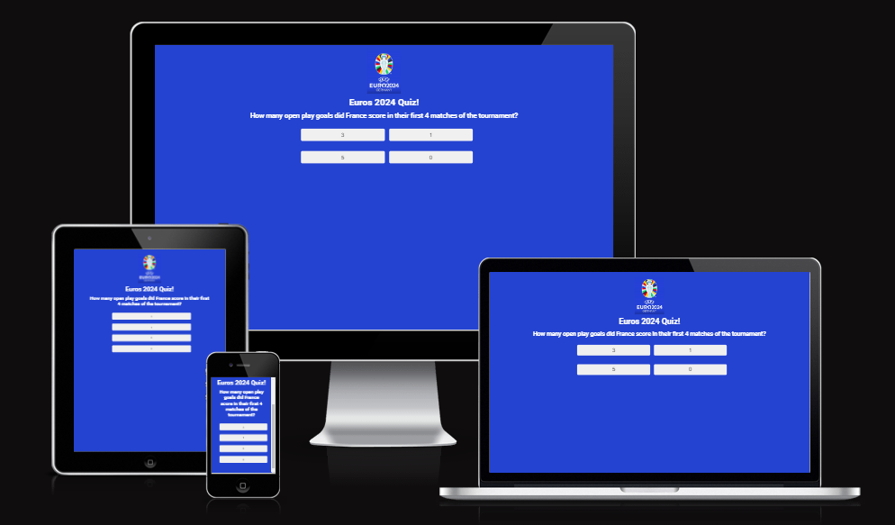
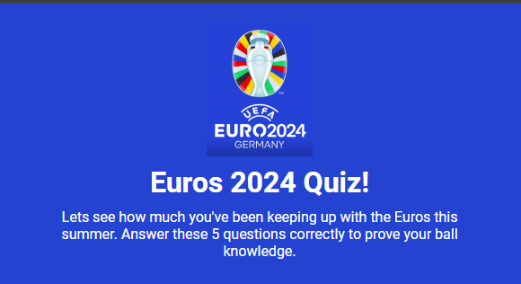
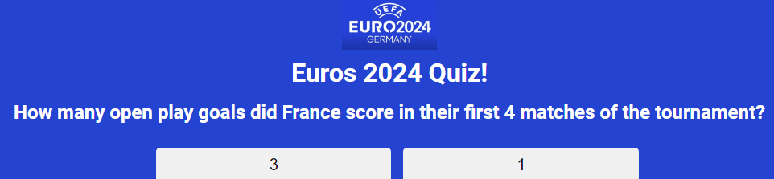
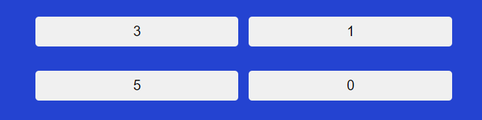
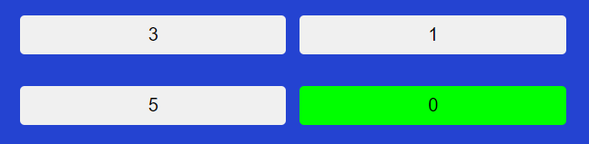
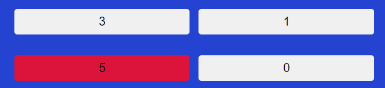
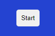
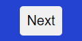
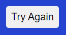
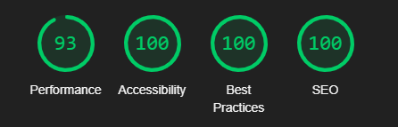

# Euros 2024 Quiz

The Euros 2024 quiz website is for the football enthusiasts around the world who want to test their knowledge of the tournament. There are 5 questions about the tournament with multi-choice answers. Depending on the user score a unique message will be displayed and the user will have another chance to complete the quiz if they choose to.

## Features

- ### Header 
   
- In the header section there is a logo of the 2024 Euros tournament, followed by the name of the website and a subtext telling the user about the quiz.

      
- ### Questions
  
- The question box in the HTML will display whatever the current question is. The question changes whenever the user clicks on the next question button which will increment through the questions array in the JS file and display the next question.

- ## Buttons
      
- ### Answer Buttons
  
- There are 4 answer boxes that each have a unique answer depending on what the current question is. They are all clickable however, clicking on a button will reveal whether the answer was correct or not, by making the button turn green if correct or red if incorrect, and remove clickability from all remaining answer buttons. If the correct answer is clicked, the users score will increase by 1. The "next question" button will only appear once the user has already selected an answer, that way it avoids the user being able to skip questions.

Correct Answers change the buttons background to green

Incorrect Answers change the buttons background to green

- ### Start Button
  
- The start button is self explanitory, it runs the playQuiz() function which starts the whole process and displays the questions, upon being clicked it also hides itself.

- ### Next Button
  
- The next question button increases the currentQuestion variable by 1, which displays the next question in the questions array. This button only appears once the user clicks on a question, this happens to avoid the user from skipping any questions. Upon being clicked this button also has addition functionality, which is to run the reset() function, this function essentially removes the recently added style classes to the buttons to reset the color, deletes their data attribute and reapplies pointer events to all answer buttons.

- ### Restart Button
  
- This button only appears when the user has completed the quiz. If the user would like to re-attempt the quiz, they can click on this button which will reset the quiz back to the first question and set the users score back to 0.

## Testing & Validation

- This project works on multiple browers, including but not limited to, Google Chrome and Mozilla Firefox.

-This project has been sent to friends and family to test user functionality and no bugs were found.

- All buttons work as intended.

- The website is responsive, everything functions as intended regardless of screen size.

- The HTML validator returned 0 errors

- The CSS validator returned 0 errors

- The JS validator returned 0 errors

- All colours passed on the WebAIM Contrast Checker

- These are the scores lighthouse returned:

    
## Bugs
    
There was bug with my code where the showScore() function would never run. I added console logs to see what the currentQuestion variable was at different points of the code and it was working as intended so I could not figure out the reason it would not run. I messed around with the conditions like increasing the number in the if statement but that did not work either. The hotfix I came up with was to add a filler question. This question exists solely to make the rest of the code run as intended and is not supposed to be displayed to the user. Removing the extra question will reveal the bug again.

## Deployment:

- The site was deployed to GitHub pages. The steps to deploy are as follows: 
  - In the GitHub repository, navigate to the Settings tab 
  - From the source section drop-down menu, select the Master Branch
  - Once the master branch has been selected, the page provided will be a link to the site

The live link can be found here - https://yahya-h-mohamed.github.io/Project-Portfolio-2-Online-Quiz/

## Credit:

## Media

All images used in this project are official artwork directly from [UEFA EUROS 2024 Website](https://www.uefa.com/euro2024/) 

